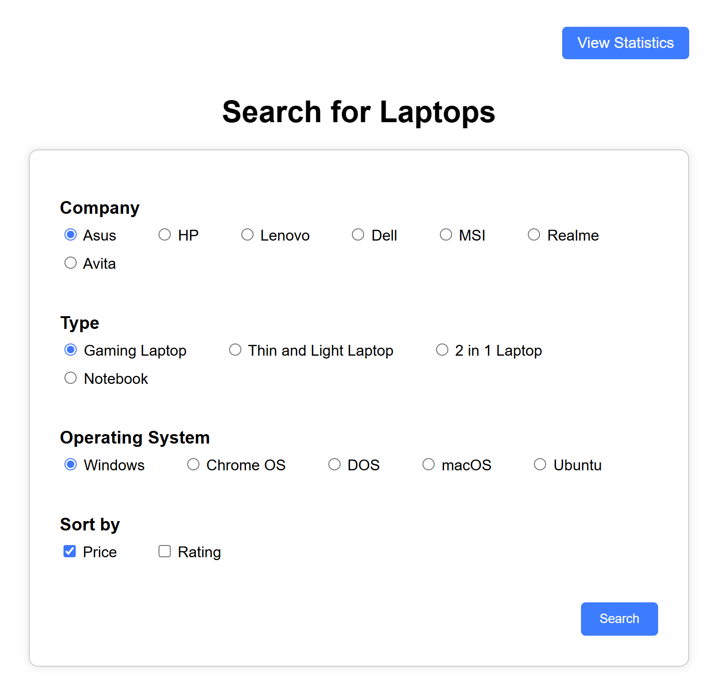
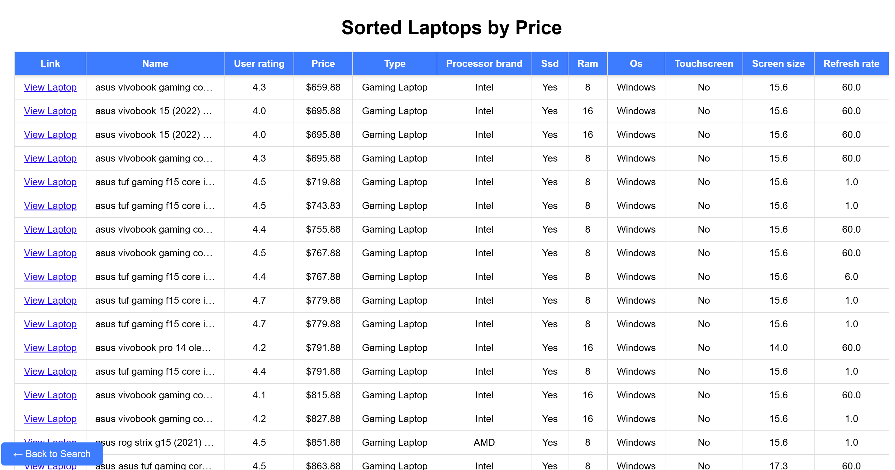

# Computare: Laptop Comparison Web App

**Computare** is a local web application that allows users to search, compare, and analyze laptops based on various filters such as brand, OS, type, price, and rating. It's designed to help students and budget-conscious users make informed decisions with both tabular search results and graphical statistics.

---

## Features

- Filter laptops by brand, OS, type, price, and rating
- Display search results in a clear, sortable table
- View statistics with charts on average price and rating by company, OS, and type
- Uses SQLite for lightweight local data storage

---

## Technologies Used

- **Flask**: Web framework for backend routing
- **SQLite**: Embedded database for storing laptop information
- **Pandas**: Data processing and aggregation
- **Matplotlib**: Data visualization (charts and graphs)
- **HTML/CSS**: User interface templates
- **SQL**: Querying the database

---

## How to Run Locally

### Prerequisites

Make sure you have:

- Python 3.9 or later installed  
- `pip` for installing Python packages

---

### 1. Clone the Repository 
```bash
git clone https://github.com/your-username/computare.git
cd computare
```

### 2. Install Dependencies
pip install flask pandas matplotlib

### 3. Start Flask App
python Computare.py

### 4. Open in Browser
http://localhost:8000

---

# Preview of Computare


(images/StatPic2.png)

